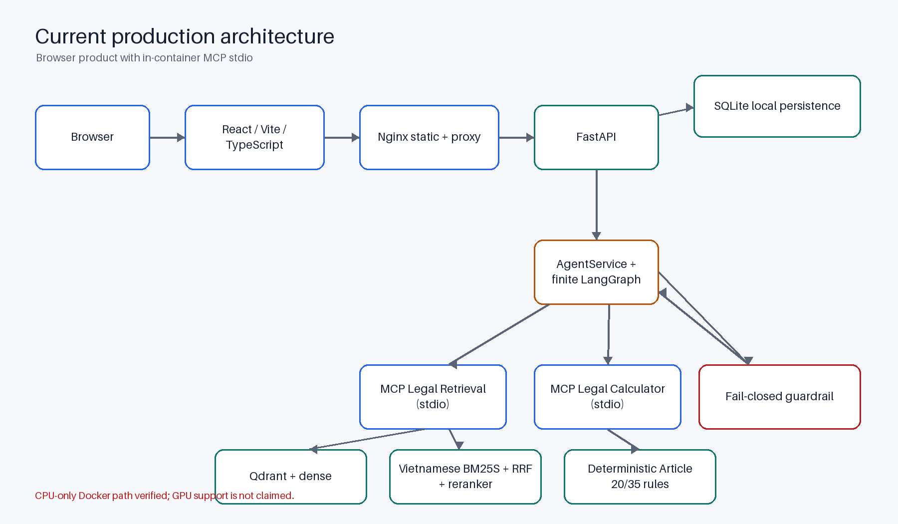
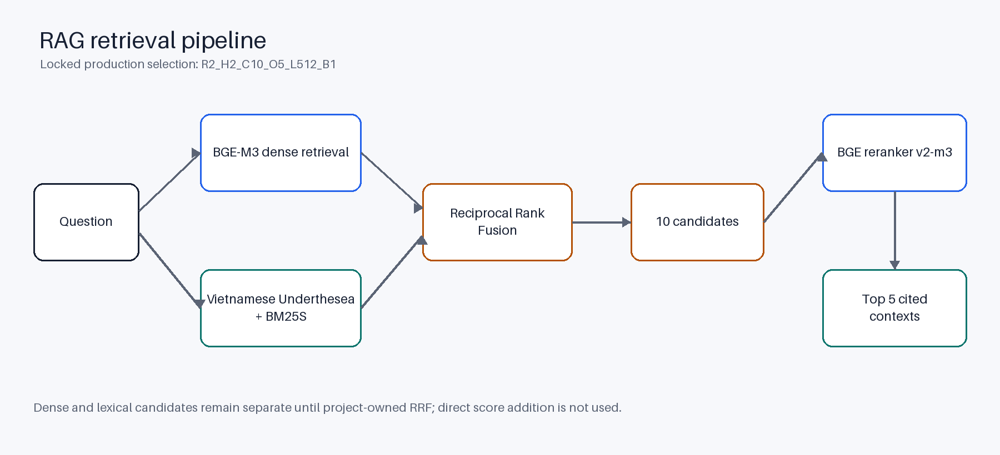
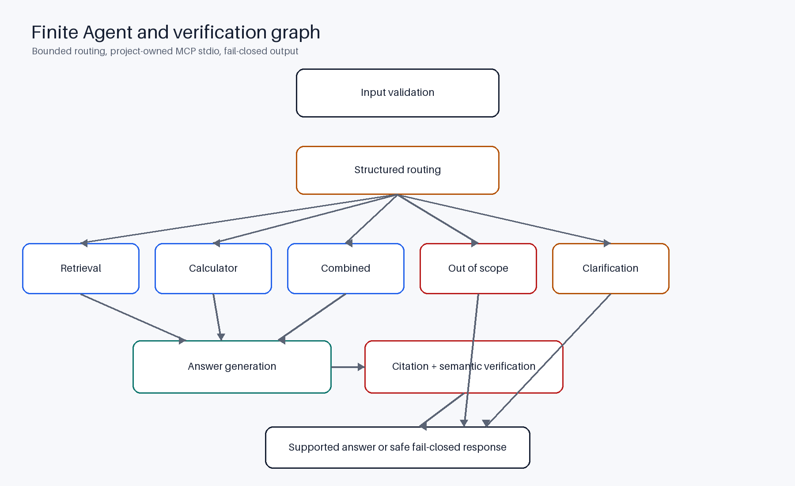
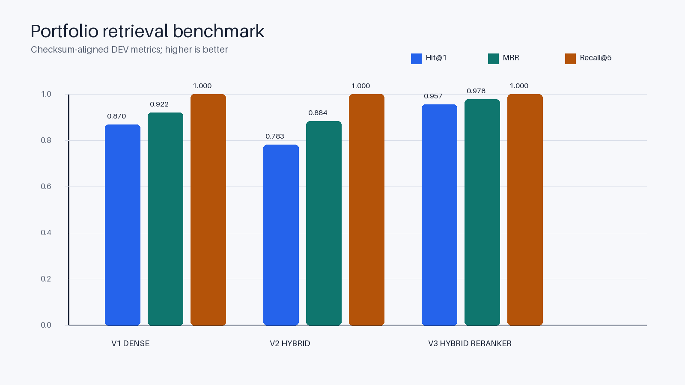

# Vietnamese Labor Law AI Assistant

A portfolio-grade, source-grounded legal-information assistant for the Vietnamese Labour Code, with
hybrid retrieval, deterministic calculators, finite Agent orchestration, real MCP stdio tools, and
fail-closed citation verification.

> **Legal disclaimer:** This project supports legal-information lookup. It is not a law firm, does
> not provide professional legal advice, and must not be used as the sole basis for a legal decision.
> Check the current authoritative law and consult a qualified professional when needed.



## Problem

General-purpose LLMs can answer fluently while citing the wrong provision or inventing support. This
project constrains answers to a canonical Vietnamese Labour Code snapshot, exposes deterministic
rules through typed tools, and rejects claims that cannot pass citation and semantic checks.

## Scope

The system covers the repository's Vietnamese Labour Code snapshot and the calculator's existing
Article 20/35 rules. It is a local, unauthenticated, single-user portfolio application. It does not
cover every Vietnamese legal instrument, external implementing regulation, case-specific legal
strategy, or legal representation.

## Key features

- React/Vite/TypeScript browser chat with history, citations, verification, sanitized tool traces,
  and up/down feedback.
- Nginx static hosting, SPA fallback, and same-origin proxy to FastAPI.
- Dense BGE-M3 and Vietnamese BM25S/Underthesea retrieval, project-controlled RRF, and BGE reranking.
- Locked production configuration: `R2_H2_C10_O5_L512_B1`.
- Finite LangGraph workflow over project-owned retrieval and calculator MCP clients.
- Real MCP servers run as stdio child processes inside the API container; they are not network MCP
  microservices.
- Deterministic Article 20/35 calculator with canonical legal provenance.
- Claim/citation membership, semantic support checks, and fail-closed output policy.
- Local SQLite conversation, message, and feedback persistence.
- Reproducible offline evidence and CPU-only Docker Compose delivery.

## Current architecture

```text
Browser
  -> React / Vite / TypeScript
  -> Nginx static frontend + same-origin proxy
  -> FastAPI
       -> SQLite persistence
       -> AgentService / finite LangGraph
            -> project-owned MCP stdio child: Legal Retrieval
                 -> Qdrant dense retrieval
                 -> Vietnamese BM25S / Underthesea lexical retrieval
                 -> reciprocal-rank fusion + reranker
            -> project-owned MCP stdio child: Legal Calculator
                 -> deterministic Article 20/35 rules
            -> fail-closed citation / semantic guardrail
```

React replaced the earlier Streamlit direction and is the only current frontend. Docker was verified
on CPU; GPU Docker support is not claimed.

## RAG pipeline



The production path embeds the question with `BAAI/bge-m3`, retrieves dense candidates from Qdrant,
and retrieves lexical candidates from a BM25S index tokenized with Underthesea. Project-owned
reciprocal-rank fusion combines ranks without directly adding incompatible scores. The locked
`BAAI/bge-reranker-v2-m3` stage reranks 10 candidates to 5 contexts using maximum length 512 and
batch size 1.

## Agent and MCP workflow



The structured router chooses retrieval, calculator, combined, out-of-scope, or clarification paths.
The graph is finite: it cannot enter a free-form tool loop. Retrieval and calculation go through
allowlisted project MCP clients and stdio servers. The Agent never accesses Qdrant or calculator
business rules directly.

## Citation verification and fail-closed behavior

Generated claims carry structured citation IDs. The guardrail checks citation syntax, membership in
the bounded retrieved/calculator evidence, canonical source identity, and semantic support. Missing,
wrong, or unsupported evidence produces a safe `UNSUPPORTED` or `INSUFFICIENT_CONTEXT` result instead
of an ungrounded answer. Thresholds remain 0.35/0.75; the optional LLM judge is disabled by default.

## Browser UI

The UI provides conversation navigation, message persistence, citation cards, verification details,
sanitized tool traces, and feedback. The browser calls only FastAPI through Nginx. It never receives
an API key or calls the LLM, Qdrant, or MCP directly.

Screenshots/GIFs and the demo video are intentionally absent until captured from a real runtime.

## Technology stack

| Area | Technology |
| --- | --- |
| Frontend | React 18, TypeScript, Vite, Tailwind CSS, Nginx |
| API and persistence | FastAPI, Pydantic, Uvicorn, SQLite |
| Retrieval | BGE-M3, Qdrant, BM25S, Underthesea, RRF, BGE reranker |
| Agent and tools | LangGraph, MCP Python SDK, project-owned stdio clients/servers |
| Safety | Canonical source registry, citation parser, BGE semantic scorer, fail-closed policy |
| Tooling | Python 3.11, uv, Ruff, Pyright, Pytest/coverage, npm, Docker Compose |

## Evaluation methodology

The portfolio keeps retrieval and system metrics separate:

- **V1_DENSE:** current BGE-M3 dense baseline.
- **V2_HYBRID:** dense + Vietnamese lexical + RRF, without reranking.
- **V3_HYBRID_RERANKER:** locked production retrieval configuration.
- **V4_MCP_AGENT_GUARDRAIL:** separate 40-case Agent and 40-case guardrail offline contract suites.

V1–V3 use the same frozen DEV split (42 questions; 23 retrieval-eligible) and aligned corpus/dataset
checksums. TEST was not used for tuning. Faithfulness, response relevancy, and answer correctness are
not reported because no reproducible judge-backed metric exists in the repository.

See [methodology](docs/evaluation/methodology.md) and the
[row-level JSON](evaluation/results/week12/benchmark_summary.json).

## Benchmark results



| Tier | Split / sample | Hit@1 | Recall@5 | MRR | Mean / P95 latency |
| --- | --- | ---: | ---: | ---: | ---: |
| V1 Dense | DEV 42 (23 eligible) | 0.8696 | 1.0000 | 0.9217 | 620.18 / 263.69 ms |
| V2 Hybrid | DEV 42 (23 eligible) | 0.7826 | 1.0000 | 0.8841 | 250.90 / 290.74 ms |
| V3 Hybrid + reranker | DEV 42 (23 eligible) | 0.9565 | 1.0000 | 0.9783 | 3706.07 / 4999.47 ms |

The preserved offline V4 contract suites remain 40 Agent and 40 guardrail cases. The final
post-remediation V4 live evaluation adds 87 real Docker/LLM CPU attempts: route/tool selection was
87/87, explicitly asserted parameters 22/22, clarification 19/19, canonical citation validity
61/61, with zero timeouts or runner errors. Mean/P95 end-to-end latency was 11.632/25.848 seconds;
complex CPU-only requests may take several or tens of seconds. See the
[final Agent/guardrail report](docs/evaluation/final_agent_guardrail.md). V1-V3 retrieval results were
not changed.

## Repository structure

```text
src/vietnamese_labor_law_assistant/  production Python package
  api/ agent/ calculator/ common/ evaluation/ generation/
  guardrails/ ingestion/ mcp_clients/ mcp_servers/ retrieval/
frontend/                            React/Vite/TypeScript application
data/                                protected source, processed, and evaluation data
evaluation/results/                  benchmark and verification evidence
evaluation/review/                   Week 12 manual-review packet
scripts/                             thin operational/generation entry points
tests/                               unit, integration, and end-to-end tests
docs/                                architecture, evaluation, and release documentation
```

Business logic stays in the production package. Scripts, API routes, and MCP servers are adapters.

## Prerequisites

- Git.
- Python 3.11 and [uv](https://docs.astral.sh/uv/).
- Node.js 20+ and npm for local frontend development.
- Docker Desktop with Docker Compose for clone-to-run.
- A valid private provider credential and network access for live Agent responses.

The canonical processed snapshot and lexical index are versioned project inputs. Model caches,
runtime databases, `.env`, `node_modules`, and `frontend/dist` are local/generated.

## Local development

```powershell
uv sync --all-groups --frozen
uv run uvicorn vietnamese_labor_law_assistant.api.main:app --host 127.0.0.1 --port 8000
```

In another terminal:

```powershell
Set-Location frontend
npm ci
npm run dev
```

Use `frontend/.env.example` only for the public local Vite base URL. Never put credentials in
`VITE_*` variables.

## Docker clone-to-run

The verified path is CPU-only:

```powershell
git clone <repository-url>
Set-Location vietnamese-labor-law-assistant
Copy-Item .env.example .env
# Edit .env privately and set a valid provider credential.
docker compose --env-file .env config --quiet
docker compose --env-file .env up -d --build --wait
docker compose --env-file .env ps
```

Open `http://localhost:8080/` and verify `http://localhost:8080/ready`. The first startup may download
models and bootstrap Qdrant. Named volumes retain Qdrant and SQLite state.

Stop without deleting persistent volumes:

```powershell
docker compose --env-file .env down
```

## External environment-file handling

To keep credentials outside the clone, point both Compose interpolation and service `env_file` at the
same absolute file:

```powershell
$env:APP_ENV_FILE = 'D:\private\vietnamese-labor-law.env'
docker compose --env-file $env:APP_ENV_FILE config --quiet
docker compose --env-file $env:APP_ENV_FILE up -d --build --wait
```

Do not copy the external file into the repository. `.env` and `.env.*` remain ignored except
`.env.example`.

## API overview

- `GET /health` — process liveness.
- `GET /ready` — corpus, retrieval, reranker, LLM configuration, semantic scorer, and SQLite checks.
- `POST /api/v1/chat` — finite Agent chat.
- `GET|POST /api/v1/conversations` — local conversation history.
- `GET /api/v1/conversations/{id}/messages` and `DELETE /api/v1/conversations/{id}`.
- `PUT /api/v1/messages/{id}/feedback`.
- Existing direct search/source/RAG endpoints under `/api/v1/`.
- `GET /openapi.json` — generated API contract.

## Testing and quality gates

```powershell
python .agents/skills/project-quality-gate/scripts/run_project_quality_gate.py
Set-Location frontend
npm ci
npm run typecheck
npm run lint
npm run build
npm audit --omit dev --audit-level high
```

Week 12 also validates benchmark schema/reproducibility, diagram regeneration, documentation paths,
protected artefacts, ignored runtime files, and Compose configuration. Live LLM/Docker smoke remains
a documented release gate because it requires credentials, models, network access, and Docker.

## Security and privacy

- Secrets are runtime-only; the frontend never receives them.
- MCP children receive an allowlisted environment rather than the full API environment.
- Tool traces and public errors omit prompts, tokens, exception text, and secret-bearing fields.
- Canonical data is read-only in Compose; mutable SQLite data uses a separate named volume.
- No authentication or multi-user isolation is implemented. Do not expose this local deployment to
  untrusted networks.
- Conversations may contain personal facts. Delete local history when it is no longer required.

## Known limitations

- Live Agent responses depend on provider availability, credentials, and network behavior.
- The legal corpus is a snapshot and may not reflect later amendments or external regulations.
- The calculator supports only its existing Article 20/35 rules. Article 35(2) no-notice cases take
  precedence over ordinary duration-based notice and preserve external or clarification qualifiers.
- Fail-closed verification can reject a useful but insufficiently supported answer.
- SQLite is local, unauthenticated, and single-user.
- CPU Docker has evidence; GPU Docker does not.
- Round-1, round-2, and round-3 human evidence is preserved. All three round-3 cases passed
  independent review; final technical validation also passed.
- Screenshots/GIF, demo video, license choice, tag, and GitHub Release are manual actions after
  technical/review completion.

## Demo scenarios

1. Ask what Article 35 says and inspect citations.
2. Ask the notice period for an indefinite contract.
3. Ask the 24-month combined calculator-and-legal-basis question.
4. Ask about traffic penalties and observe the out-of-scope refusal.
5. Ask for Article 999 and observe insufficient context.
6. Ask about two valid articles, then a valid/missing pair.
7. Add feedback, reload, and confirm SQLite persistence.

Use the [recording guide](docs/releases/demo_recording_guide.md) for the real 3–5 minute demo.

## Reproducibility

The versioned [final release manifest](evaluation/results/week12/final_release_manifest.json)
identifies the current post-remediation candidate while preserving historical release and remediation
manifests unchanged. It records the corpus, dataset, split, lockfiles, Compose candidate, review
archives, config, and guardrail thresholds without secrets. See
[manifest documentation](docs/releases/final_release_manifest.md).

## Release status

Current status is `WEEK12_TECHNICAL_AND_REVIEW_COMPLETE_MANUAL_RELEASE_ACTIONS_REQUIRED`. Independent
round-3 review and final technical validation passed. License selection, genuine media, GitHub README
rendering review, final commit/push and successful release-commit Actions, annotated tag, GitHub
Release, and CV/LinkedIn updates remain manual. See the [release checklist](docs/releases/release_checklist.md).

## License

No repository license has been selected. Until the owner chooses and adds a `LICENSE`, no open-source
license is asserted by this README.

## Acknowledgements and data attribution

The project uses the Vietnamese Labour Code source snapshot documented by
`data/raw/source_metadata.json`. Retrieval uses BAAI BGE models, Qdrant, BM25S, and Underthesea;
orchestration uses LangGraph and MCP; the product uses FastAPI, React, Vite, Nginx, and SQLite.
